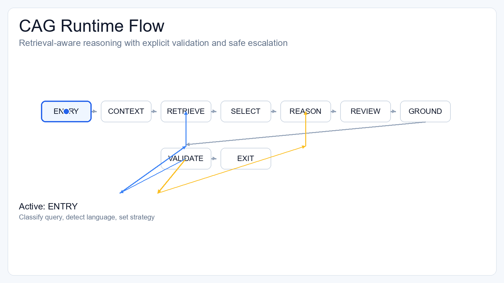

# CAG


A safer RAG pipeline that selects evidence, validates answers, and refuses when docs are insufficient.

## Language

- [English](#english)
- [Italiano](#italiano)

## English

### What Is CAG?

CAG is a graph-driven document QA runtime for builders who need more control than plain `retrieve -> generate`.

Core loop:

`ENTRY -> CONTEXTUALIZE_QUERY -> RETRIEVE -> SELECT_CONTEXT -> REASON -> REVIEW -> POST_GROUNDING -> VALIDATE -> EXIT`

### Core Idea

Grounding quality is mostly a retrieval-orchestration problem, not only a generation problem.

Most RAG failures happen before final answer generation:
- wrong retrieval strategy for the query type
- redundant or weak context sent to the model
- no explicit validation of evidence sufficiency

CAG treats these as first-class architecture concerns.

### Animated Overview (GIF)



If the GIF is not visible yet, add `docs/assets/cag-flow.gif` to the repository.

### CAG Logic (Full Flow)

#### 1. ENTRY
- classify query type (`GENERAL`, `PROCEDURAL`, `DIAGNOSTIC`, `CONFIGURATION`)
- infer scope (domain/consultative/personal)
- detect response language
- initialize retrieval strategy and plan

#### 2. CONTEXTUALIZE_QUERY
- rewrite vague follow-ups using conversation history
- preserve intent while adding retrieval anchors

#### 3. RETRIEVE
- build query variants (rewrite + concept expansion)
- search document profiles first (Document Map)
- fallback to semantic retrieval when needed
- optional lexical hybrid merge
- dedupe/rerank with discriminative lexical scoring

#### 4. SELECT_CONTEXT
- rank for answerability, not only similarity
- apply relevance/category/source diversity
- keep compact context budgets
- output ranked chunks and explicit gaps

#### 5. REASON + REVIEW
- generate from selected evidence only
- output confidence, citations, hallucination risk
- review pass tightens grounding language

#### 6. POST_GROUNDING
- sentence-level support checks
- detect unsupported claims
- adjust confidence/risk when support is weak

#### 7. VALIDATE
- route to one of:
  - `EXIT`
  - `REASON` retry
  - `RETRIEVE` adaptive retry
- escalate when evidence remains insufficient

#### 8. EXIT
- return final answer or escalation message
- attach diagnostics (`node_trace`, confidence, risk, fallback flags)

### ASCII Diagrams

- [CAG ASCII Flow](docs/cag-flow-ascii.md)

Quick view:

```text
ENTRY -> CONTEXTUALIZE_QUERY -> RETRIEVE -> SELECT_CONTEXT -> REASON -> REVIEW -> POST_GROUNDING -> VALIDATE -> EXIT
                                              ^                                            |
                                              |                                            |
                                              +---------------- RETRIEVE RETRY <-----------+
                                                                   ^
                                                                   |
                                                           REASON RETRY
```

### Start Here

- [Quickstart](docs/quickstart.md)
- [API](docs/api.md)
- [Configuration](docs/configuration.md)
- [Evaluation](docs/evaluation.md)
- [Examples](docs/examples.md)
- [Integration](docs/integration.md)
- [Architecture](docs/cag-architecture.md)
- [Knowledge Compiler](docs/knowledge-compiler.md)
- [Community](docs/community.md)

Fast path:

```bash
pip install -e ".[dev,eval,api]"
cag demo --reset --json
```

### 5 Minute Quickstart

```bash
python -m venv .venv
.venv\Scripts\activate   # Windows
pip install -e ".[dev,eval,api]"
cag demo --reset --json
```

### STRICT_FAST Mode (Faster, Still Rigorous)

```env
STRICT_FAST_PROFILE=true
```

Speed-oriented overrides:
- lower retrieval/context budgets
- disables adaptive retrieval retry
- disables hybrid lexical merge
- keeps deterministic fast context path enabled

Rigor remains:
- `VALIDATE` stays active
- confidence/hallucination thresholds still enforced
- escalation still triggers when evidence is weak

### Data Safety (Raw Documents)

- `data/raw` is for local ingestion only.
- do not commit private/source customer documents.
- only publish sanitized public demo corpora.
- never commit API keys or secrets.

Current policy:
- `.pdf/.txt/.md` in `data/raw` are ignored by `.gitignore`

### Known Limits

- benchmark coverage is still limited vs full production variability
- CAG can be slower/costlier than simple RAG
- retrieval gains can be dataset-sensitive
- provider/model behavior can vary

### 30-Day Roadmap

1. publish updated multi-run benchmark snapshots
2. improve retrieval diagnostics in public outputs
3. strengthen release automation and benchmark gates
4. expand onboarding docs/examples for contributors

### Pre-Push Public Checklist

1. rotate exposed keys and keep `.env` untracked
2. verify no private raw docs are tracked
3. run tests and benchmark smoke checks
4. update benchmark snapshot in docs
5. publish changelog/release notes with known limits

### Repository Structure

```text
src/cag/
  agents/
  api/
  eval/
  graph/
  ingestion/
  retrieval/
  knowledge/
frontend/
docs/
tests/
```

### Community

- [CONTRIBUTING.md](CONTRIBUTING.md)
- [CODE_OF_CONDUCT.md](CODE_OF_CONDUCT.md)
- [SECURITY.md](SECURITY.md)
- [NOTICE](NOTICE)

### Attribution Request

CAG is MIT-licensed. If you use CAG publicly, attribution is appreciated:

`Built with CAG by Fabio Scialanga`

## Italiano

### Cos'e CAG?

CAG e' un runtime di document QA guidato da grafo, pensato per chi vuole piu' controllo rispetto al classico `retrieve -> generate`.

Loop principale:

`ENTRY -> CONTEXTUALIZE_QUERY -> RETRIEVE -> SELECT_CONTEXT -> REASON -> REVIEW -> POST_GROUNDING -> VALIDATE -> EXIT`

### Idea Centrale

La qualita' del grounding e' soprattutto un problema di orchestrazione del retrieval, non solo di generazione.

La maggior parte degli errori RAG nasce prima della risposta finale:
- strategia retrieval sbagliata per il tipo di domanda
- contesto ridondante o debole passato al modello
- assenza di validazione esplicita della sufficienza delle evidenze

CAG tratta questi aspetti come scelte architetturali di primo livello.

### Panoramica Animata (GIF)


Se la GIF non e' ancora visibile, aggiungi `docs/assets/cag-flow.gif` al repository.

### Logica CAG (Flusso Completo)

#### 1. ENTRY
- classifica il tipo query (`GENERAL`, `PROCEDURAL`, `DIAGNOSTIC`, `CONFIGURATION`)
- identifica lo scope (domain/consultative/personal)
- rileva la lingua di risposta
- inizializza strategia e piano retrieval

#### 2. CONTEXTUALIZE_QUERY
- riscrive follow-up vaghi usando la history
- mantiene l'intento aggiungendo anchor utili al retrieval

#### 3. RETRIEVE
- costruisce varianti query (rewrite + concept expansion)
- cerca prima nei document profile (Document Map)
- fallback semantico globale quando necessario
- merge lexical hybrid opzionale
- dedupe/rerank con scoring lessicale discriminativo

#### 4. SELECT_CONTEXT
- ordina per answerability, non solo similarita'
- bilancia rilevanza/diversita' categoria/diversita' fonte
- mantiene budget contesto compatto
- produce chunk ordinati e gap espliciti

#### 5. REASON + REVIEW
- genera solo dalle evidenze selezionate
- emette confidence, citazioni, rischio allucinazione
- review stringe il linguaggio non supportato

#### 6. POST_GROUNDING
- controlli frase-per-frase del supporto evidenze
- rileva claim non supportati
- aggiorna confidence/risk quando il supporto e' debole

#### 7. VALIDATE
- instrada verso:
  - `EXIT`
  - retry `REASON`
  - retry adattivo `RETRIEVE`
- scala quando l'evidenza resta insufficiente

#### 8. EXIT
- restituisce risposta finale o escalation
- allega diagnostica (`node_trace`, confidence, risk, fallback)

### Diagrammi ASCII

- [Flusso ASCII CAG](docs/cag-flow-ascii.md)

Vista rapida:

```text
ENTRY -> CONTEXTUALIZE_QUERY -> RETRIEVE -> SELECT_CONTEXT -> REASON -> REVIEW -> POST_GROUNDING -> VALIDATE -> EXIT
                                              ^                                            |
                                              |                                            |
                                              +---------------- RETRIEVE RETRY <-----------+
                                                                   ^
                                                                   |
                                                           REASON RETRY
```

### Inizia Da Qui

- [Quickstart](docs/quickstart.md)
- [API](docs/api.md)
- [Configurazione](docs/configuration.md)
- [Valutazione](docs/evaluation.md)
- [Esempi](docs/examples.md)
- [Integrazione](docs/integration.md)
- [Architettura](docs/cag-architecture.md)
- [Knowledge Compiler](docs/knowledge-compiler.md)
- [Community](docs/community.md)

Percorso veloce:

```bash
pip install -e ".[dev,eval,api]"
cag demo --reset --json
```

### Quickstart In 5 Minuti

```bash
python -m venv .venv
.venv\Scripts\activate   # Windows
pip install -e ".[dev,eval,api]"
cag demo --reset --json
```

### Modalita STRICT_FAST (Piu' Veloce, Ancora Rigorosa)

```env
STRICT_FAST_PROFILE=true
```

Override orientati alla velocita':
- budget retrieval/context piu' bassi
- disattiva adaptive retrieval retry
- disattiva merge lexical hybrid
- mantiene attiva la fast context selection deterministica

La rigorosita' resta:
- `VALIDATE` rimane attivo
- soglie confidence/hallucination restano attive
- escalation resta attiva con evidenza debole

### Sicurezza Dati (Documenti Raw)

- `data/raw` e' solo per ingest locale
- non committare documenti privati o cliente
- pubblicare solo corpora demo sanitizzati
- non committare mai API key o segreti

Policy attuale:
- i file `.pdf/.txt/.md` in `data/raw` sono ignorati da `.gitignore`

### Limiti Noti

- copertura benchmark ancora limitata rispetto alla variabilita' reale
- CAG puo' essere piu' lento/costoso di RAG semplice
- i guadagni retrieval possono dipendere dal dataset
- il comportamento puo' variare tra provider/modelli

### Roadmap 30 Giorni

1. pubblicare snapshot benchmark multi-run aggiornati
2. migliorare diagnostica retrieval negli output pubblici
3. rafforzare release automation e benchmark gates
4. espandere docs/esempi onboarding contributor

### Checklist Pre-Push Pubblico

1. ruotare chiavi esposte e tenere `.env` non tracciato
2. verificare che non ci siano raw docs privati tracciati
3. eseguire test e benchmark smoke
4. aggiornare snapshot benchmark nelle docs
5. pubblicare changelog/release notes con limiti noti

### Struttura Repository

```text
src/cag/
  agents/
  api/
  eval/
  graph/
  ingestion/
  retrieval/
  knowledge/
frontend/
docs/
tests/
```

### Community

- [CONTRIBUTING.md](CONTRIBUTING.md)
- [CODE_OF_CONDUCT.md](CODE_OF_CONDUCT.md)
- [SECURITY.md](SECURITY.md)
- [NOTICE](NOTICE)

### Richiesta Di Attribuzione

CAG e' rilasciato con licenza MIT. Se usi CAG in pubblico, l'attribuzione e' apprezzata:

`Built with CAG by Fabio Scialanga`

## License

[MIT](LICENSE)
